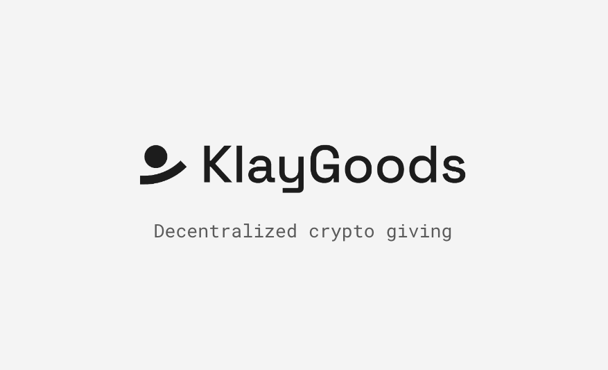

# KlayGoods: Decentralized Giving Platform

A Klatyn-native decentralized giving platform to help public good projects fundraise for their causes. This project started as a submission to the KlayMakers 2022 Hackathon hosted by the Klaytn Foundation.



### Relevant Links

- Check out the [Live Deployment](https://klaygoods.org)
- Check out the [Walkthrough Demo](https://vimeo.com/759768734)
- Discourse Forum: https://klaygoods.discourse.group/
- Snapshot DAO Governance: https://snapshot.org/#/0xcarhartt.eth
- Quadratic Funding Mechanism ([`/funding-mechanism`](funding-mechanism))

### Motivation

We saw that Klaytn blockchain was missing a key infrastructure to support public goods projects on its platform. For this hackathon, instead of creating a single project to help a particular cause, we saw an opportunity to create an entire platform to facilitate seamless funding of any public goods projects on the Klaytn blockchain.

### Problems that KlayGoods Solve:

- Universal reach: centralized crowdfunding platforms limit to users with “major debit card or credit card” and a whitelist of certain countries where the service is available. Now with only a self-custody crypto wallet, anyone in the world can donate to any cause
- Preventing censorship: centralized crowdfunding are prone to censoring projects that don’t align with their ideology (random example, not sure how legit but proves a point)
- Algorithmic funding: on top of linear funding, we can implement more interesting funding algorithms like quadratic funding that further democratizes our giving mechanism
- Governance: anyone with the KlayGoods token (KLGD) can participate in the governance of the platform to propose and vote on various proposals. Some possible DAO workstreams can be funding publics goods with treasury, rewarding contributors, public goods prototyping (funding solutions to improve public goods funding), etc.

### Features

- Donate to public good causes on Klaytn blockchain
- List a new cause and fundraise with KLAY
- View profiles of platform users and showcase supporting causes
- Propose and vote for KlayGoods DAO governance

### Contracts

KLGD Token (Baobao Testnet): [0x765Dd41FBA7Fbac6AA848fBBa27cCe38c9dC500f](https://baobab.scope.klaytn.com/account/0x765Dd41FBA7Fbac6AA848fBBa27cCe38c9dC500f)

### Getting Started

First, run the development server:

```bash
npm run dev
```

Open [http://localhost:3000](http://localhost:3000) with your browser to see the result.

### Tech Stack

- Network: Klaytn
- File Storage: IPFS + Firebase
- Host Service: Vercel
- Ethereum Dev Framework: Hardhat
- Frontend Framework: NextJS
- Frontend UI Library: Chakra UI

### Next Steps

- Add testing to all aspects of the codebase
- Add responsive design for cross-platform support
- Add fiat balance support in preparation for Mainnet
- Add more interesting funding mechanisms for fundraising
- Find a talented team to help build out the vision
